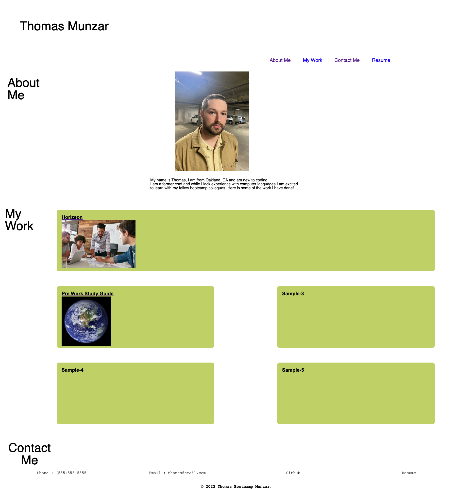

# Portfolio-Thomas-Munzar

## Technology Used
| Technology Used         | Resource URL           | 
| ------------- |:-------------:| 
| HTML    | [https://developer.mozilla.org/en-US/docs/Web/HTML](https://developer.mozilla.org/en-US/docs/Web/HTML) | 
| CSS     | [https://developer.mozilla.org/en-US/docs/Web/CSS](https://developer.mozilla.org/en-US/docs/Web/CSS)      |   
| Git | [https://git-scm.com/](https://git-scm.com/)     |   

## Description

In this project, I created a portfolio for myself as I begin my coding education.  We were not given any starter code so 
everything that makes up this portfolio is from scratch. I really struggled with this project but was pushed to learn alot 
by struggling with each line of code. So even though im not thrilled with how the webpage ended up looking. I am really proud
of the amount of work and energy I put into it.

The purpose of creating this webpage is to have a nice webpage for me to continuously edit and add to as I go through this course. Right now I only have two examples of my work on the page but soon I will be able to add more projects that I have worked on. This is important because I will be using this portfolio when I apply to jobs at the end of this course. I will most likely be going back into the html and css files alot to make changes as I get more confident with coding. I used [W3Schools](https://www.w3schools.com/) a ton for this project as well as [CssReference](https://cssreference.io/) and [ChatGPT](https://openai.com/blog/chatgpt) to answer many many questions and to clarify aspects of html and css. I also had a huge amount of support from my classmates.


## CSS Styling Example

I was able to learn a lot of cool styling tools online. One of my favorite things I learn was a hover method that made a line appear under the words in my nav bar. The code looked like this.

```css
/*This section will control what happens after the mouse hovers over the items on the nav bar*/
nav ul li a::after {
    content: '';
    width: 0%;
    height: 3px;
    background: hotpink;
    position: absolute;
    left: 0;
    bottom: -5px;
    transition: .9s;

}

nav ul li a:hover::after {
    width: 100%;
}
```

Its not alot of code, but I spent around 2 hours just trying to space the nav bar the way I wanted to and to style it in a unique way. There are so many options so it got a bit overwhelming to actualy pick a style I liked.

## Usage

Here is a screen shot of my webpage.



## Learning Points

A huge lesson I learned during this challenge was that div tags are really really helpful for organizing your HTML. After the first project I thought that they were a big No no, but after more research and conversations I have learned that they are extremely helpful if you use them wisely and give them specific ID's or Classes. I also learned the CSS is such a powerful tool and is so hard to use and get right. I worked so hard on this project and still feel so brand new to css in general, hopefully after this bootcamp i will feel differently.
I tried as hard as i could to understand how to use media queries, i still am very lost on them and dont think i used them correctly at all. Will need to study that extra hard.


## Author Info

Thomas Munzar is from Oakland,CA and is a chef who is learning how to code. He is very tired but pretty happy with how this webpage turned out.

## Credits

Again, Shouts out my fellow classmates, teachers and my family.

## Liscense

MIT License

Copyright (c) [2023] [Thomas Munzar]

Permission is hereby granted, free of charge, to any person obtaining a copy
of this software and associated documentation files (the "Software"), to deal
in the Software without restriction, including without limitation the rights
to use, copy, modify, merge, publish, distribute, sublicense, and/or sell
copies of the Software, and to permit persons to whom the Software is
furnished to do so, subject to the following conditions:

The above copyright notice and this permission notice shall be included in all
copies or substantial portions of the Software.

THE SOFTWARE IS PROVIDED "AS IS", WITHOUT WARRANTY OF ANY KIND, EXPRESS OR
IMPLIED, INCLUDING BUT NOT LIMITED TO THE WARRANTIES OF MERCHANTABILITY,
FITNESS FOR A PARTICULAR PURPOSE AND NONINFRINGEMENT. IN NO EVENT SHALL THE
AUTHORS OR COPYRIGHT HOLDERS BE LIABLE FOR ANY CLAIM, DAMAGES OR OTHER
LIABILITY, WHETHER IN AN ACTION OF CONTRACT, TORT OR OTHERWISE, ARISING FROM,
OUT OF OR IN CONNECTION WITH THE SOFTWARE OR THE USE OR OTHER DEALINGS IN THE
SOFTWARE.